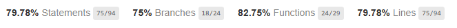

# Projektbericht für die Todo Anwendung
Diese Datei enthält den Projektbericht für die Todo Anwendung. Der Bericht wird im Rahmen des Moduls `Softwarequalität` an der [Fachhoschule Südwestfalen](www.fh-swf.de) erstellt.

## Gruppenmitglieder
* Christian Peters
* Kevin Hillebrand
* Tim Tomczek

## Vorgehensweise
Zuerst wurde eine Build-Pipeline mit GitHub-Actions erstellt. In der Die Anwendung gebaut und mit Cypress, für End-to-End (E2E) Tests, und Jest, für Unit-Tests, getestet wird. Anschließend wurden die Funktionen der Anwendung untersucht und mit E2E Tests abgedeckt. Für die Unit-Tests wurde geprüft ob für jede Funktion ein Test vorhanden ist. Die Überprüfung der Vollständigkeit der Tests erfolgte durch die Analyse der Code-Coverage durch Jest. Durch weitere Tests wurde die Abdeckung erhöht. Abschließend wurden die gefundenen Bugs dokumentiert und Lösungen für diese erarbeitet.

## Lösungen
// TODO

## Probleme
### Unit-Tests benötigen eine Datenbank (TODO)
    Die Unit-Tests benötigen eine Datenbank, um die Funktionalität zu testen. Dadurch handelt es sich nicht mehr um Unit-Tests sondern um Integrationstests. Für Unit-Tests sollten die index.js und die DB-Klass einzeln getestet werden und es sollte kein externes System benötigt werden. Uns ist es nicht gelungen einen die Datenbank zu mocken, sodass die Tests ohne eine echte Datenbank laufen. Die Tests sind daher als Integrationstests zu betrachten.

### Anwendung stürzt ab, wenn ein Todo gelöscht wird
    Wenn ein Todo gelöscht wird, stürzt die Anwendung ab. Dies sorgt dafür, dass die nachfolgenden E2E-Tests nicht mehr ausgeführt werden können. Dieses Problem wurde dadurch behoben, dass die Anwendung bei einem Absturz automatisch durch nodemon neugestartet wird. Dazu werden Events von nodemon verwendet. Dadurch können die einzelnen Tests noch ausgeführt werden. Um einen Absturz der Anwendung zu bemerken, wird die Ausgabe des npm run start Befehls in einer Log-Datei gesichert und in der CI/CD-Pipeline auch archiviert. In der Pipeline wird diese Datei zusätzlich noch nach Hinweisen auf einen Absturz durchsucht. Wird dort ein Absturz gefunden, wird der Job als fehlgeschlagen markiert.

## Ergebnisse der QS
### Jest Analyse
Durch die Jest-Tests sind einige Fehler bei der Behandlung von Fehlern audgefallen, die nun behoben werden müssen. Durch diese Fehler ist es ohne Änderungen an der Anwendung nich tmöglich eine 100%-ige Code-Abdeckung zu erreichen.

Die aktuelle Code-Abdeckung ist im nachfolgenden Screenshot zu sehen:

### Gefundene Bugs
| Verhalten                                                                         | Erwartetes Verhalten                                                                                                                      |
|-----------------------------------------------------------------------------------|-------------------------------------------------------------------------------------------------------------------------------------------|
| Das Löschen eines Todo lässt die Anwendung abstürzen                              | Das Löschen eines Todos sollte das Todo aus der Liste und der Datenbank entfernen                                                         |
| Das Ändern des Namens eines Todos hängt den neuen Namen an den alten an           | Der Name des Todos sollte überschrieben werden                                                                                            |
| Die Anwendung verügt über keine Authentifizierung                                 | Bei dem Aufruf der Seite wird eine Anmeldemaske angezeigt. Aufrufe der Enpunkte ohne gültiges Token werden mit dem Status 401 beantwortet |
| Die Anwendung verfügt über keine Validierung ob ein gültiges Todo übergeben wurde | Ein Todo mit einem Namen der weniger als 3 Zeichen lang ist, wird abgelehnt                                                               |

### SonarQube Analyse
// TODO
