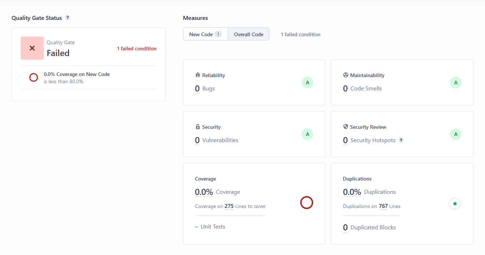
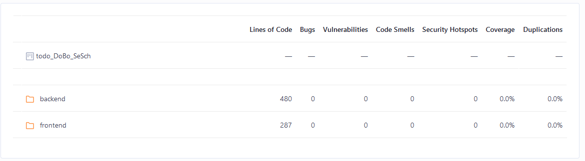
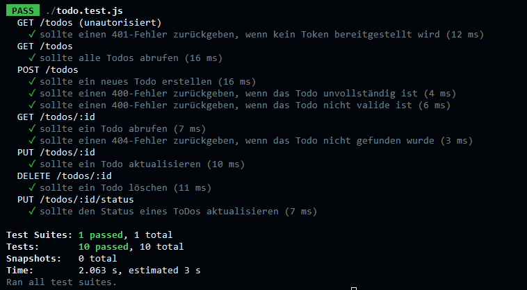

#Bericht

##Teilnehmer
    [Dominik Bock](https://github.com/DoBo91)          -Matrikel Nr. 30074561
    [Sebastian Schmidt](https://github.com/DrDigits)   -Matrikel Nr.

##Vorgehensweise zur Lösung der Aufgabenstellung in [README_Aufgabe2.md](./README_Aufgabe2.md)

##SonarQube Analyse( auch im [README_Aufgabe2.md](./README_Aufgabe2.md)) beschrieben

  -Fehlerhafte Code Smells, durch das Wort "Todo". Dieser Fehler wurde als falsch makierter Fehler acknowledged.
  -Security Problem bezüglich des Test Passwort reviewed und akzeptiert
  -ungenutzte Pakente entfernt
  -Bugs bereinigt und gesäubert

Coverage-Problem in SonarQube
Coverage wird von SonarQube nicht erkannt.

Dieses Problem konnten wir auch durch diverse Tests und anpassungen nicht beheben. Wir haben probiert dies über Parameter in der [sonar-project.properties](./sonar-project.properties) zu beheben.
Hier haben wir probiert nur die benötigten Bereich und Ordner zu definieren. Dies klappt auch soweit und es werden als Quellen nur frontend und backend genutzt.
Des Weiteren wollten wir gerne einen Report durch die Testsuite erzuegen lassen, welcher als lcov.info abgelegt wird, damit SonarQube diesen Verabreiten kann. Dies hat leider nicht funktioniert.

Tests

