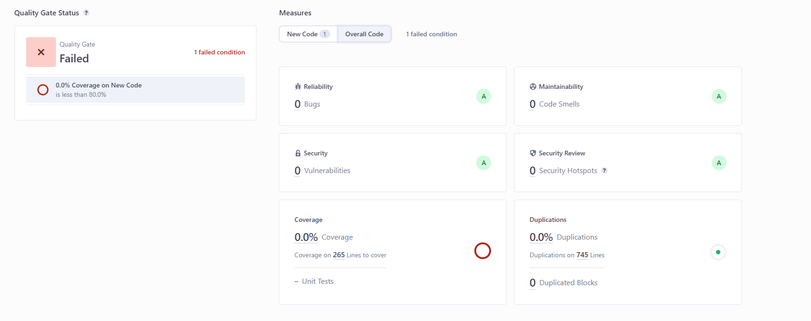

# Bericht

- [Dominik Fladung](https://github.com/dominikfladung)
- [Timo Köster](https://github.com/TimoKoester)

## Vorgehensweise

Siehe [README_Aufgabe2.md](./README_Aufgabe2.md)

## [SonarQube](https://hopper.fh-swf.de/sonarqube/dashboard?id=TODon-t-try-this-at-home-kids-)



- Fehlerhafte Issues, durch das Wort "Todo", welches in dieser Anwendung kein Hinweis auf eine Aufgabe ist, sondern nur die Bezeichnung eines Models. Diese Issues wurden als Abgeschlossen markiert, da sie nicht relevant sind.
- Einzelne Fehler wurden behoben
- Test Passwort wurde ignoriert
- Sicherheitslücke gefixt mit `app.disable("x-powered-by");` aus dem Lösungsvorschlag des [Issues](https://hopper.fh-swf.de/sonarqube/security_hotspots?id=TODon-t-try-this-at-home-kids-&hotspots=AYu9_EGRGhkFKGC0cK2a).

## Coverage

### SonarQube

Durch `npm run coverage` wird `coverage/lcov.info` generiert, welches Sonarqube zur Verfügung gestellt wird. 
In `sonar-project.properties` ist der Pfad hierfür hinterlegt.

### Jest

```
------------------|---------|----------|---------|---------|-------------------------------------------------
File              | % Stmts | % Branch | % Funcs | % Lines | Uncovered Line #s                               
------------------|---------|----------|---------|---------|-------------------------------------------------
All files         |   78.99 |       75 |   85.29 |   78.81 |                                                 
 db.js            |   77.14 |    66.66 |   91.66 |   77.14 | 59-65,81-82,100-101                             
 index.js         |   78.26 |       75 |   77.77 |   77.94 | 189-190,237-239,246-251,285-286,293-294,328-333 
 jwtMiddleware.js |     100 |      100 |     100 |     100 |                                                 
 utils.js         |   71.42 |      100 |     100 |   71.42 | 26-27                                           
------------------|---------|----------|---------|---------|-------------------------------------------------
```

## Tests

```
> todo-backend@1.0.0 test
> NODE_OPTIONS=--experimental-vm-modules npx jest

(node:25101) ExperimentalWarning: VM Modules is an experimental feature and might change at any time
(Use `node --trace-warnings ...` to show where the warning was created)
  console.log
    Connected to database

      at log (index.js:111:13)

  console.log
    Server listening on port 3000

      at Server.log (index.js:344:21)

 PASS  ./todo.test.js
  GET /todos (unautorisiert)
    ✓ sollte einen 401-Fehler zurückgeben, wenn kein Token bereitgestellt wird (12 ms)
  GET /todos
    ✓ sollte alle Todos abrufen (22 ms)
  POST /todos
    ✓ sollte ein neues Todo erstellen (19 ms)
    ✓ sollte einen 400-Fehler zurückgeben, wenn das Todo unvollständig ist (4 ms)
    ✓ sollte einen 400-Fehler zurückgeben, wenn das Todo nicht valide ist (5 ms)
  GET /todos/:id
    ✓ sollte ein Todo abrufen (10 ms)
    ✓ sollte einen 404-Fehler zurückgeben, wenn das Todo nicht gefunden wurde (5 ms)
  PUT /todos/:id
    ✓ sollte ein Todo aktualisieren (10 ms)
  DELETE /todos/:id
    ✓ sollte ein Todo löschen (13 ms)

Test Suites: 1 passed, 1 total
Tests:       9 passed, 9 total
Snapshots:   0 total
Time:        1.825 s, estimated 2 s
Ran all test suites.
```