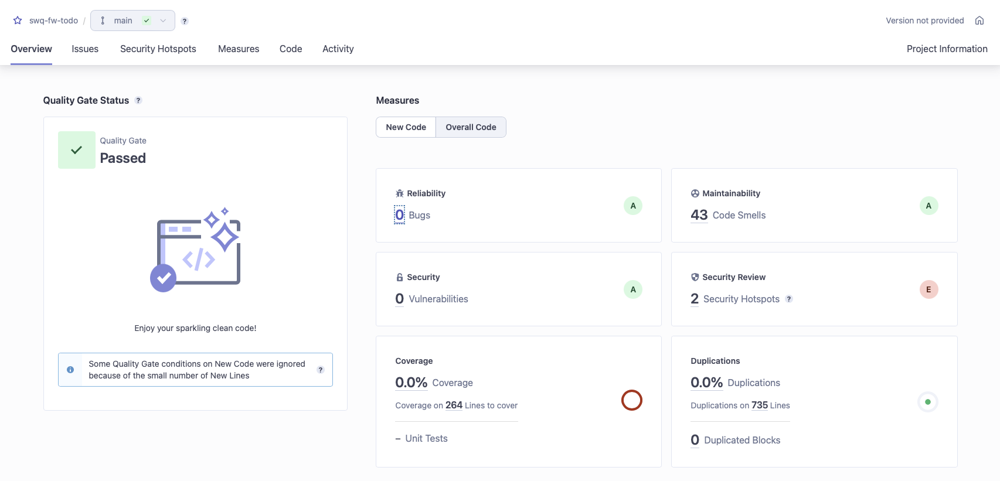

# Aufgabe 2: Testautomatisierung

## Gruppenmitglieder:
- Felix Weßollek

## Vorgehen:
- Überblick über Anwendung verschafft
- Codespace gestartet
- Bereits vorhandene Tests ausgeführt
- Code angepasst, bis vorhandene Tests erfolgreich waren
- Action für Test erstellt, "Node.js" Template als Ausgang gewählt und angepasst
- sonarqube verbunden
- Behebbare Fehler aus sonarqube behoben

## Schwierigkeiten:
- Ausführen der Anwendung lokal nicht möglich, fehlende Anleitung
    - *Lösung: Codespace genutzt*
- Authentifizierung funktioniert nicht
    - Lösungsansätze:
        - Alternative Middleware nutzen
            - mit Passport experimentiert, funktioniert
        - ChatGPT um Hilfe gebeten -> Ergebnisse durchwachsen
        - Public Key fest hinterlegt, falls Probleme mit Keycloak in Verbindung mit Codespaces bestehen
    - undefined bei Authentifizierung anstatt "Unauthorized"
        - Lösungsansätze:
            - versucht den Authorization Header im Test explizit auf '' zu setzen -> ohne Erfolg
            - versucht anstatt auf !token, auf token === undefined zu prüfen -> kein Erfolg
            - Test für Middleware implementiert, um Konfiguration zu prüfen 
                - Lösungsansätze von ChatGPT funktionierten nicht, Fehlersuche mit ChatGPT und Google aussichtslos
            - selbes Problem bei Nutzung von Passport
        - *Lösung: "Unauthorized" wurde als "message" gesendet, nicht aber als "error". JWT Strategy wurde angepasst und es funktionierte.*
- Verständnisproblem: "Invalide" Todos: Paremter "invalid" oder zu viele Parameter?
    - *Lösung: "Zu viele Paramter" ergibt mehr Sinn - ist bereits mit vorherigem Test (zu wenig Parameter) abgedeckt*
- Anwendung nicht im Root Verzeichnis des Repos führt zu Problemen bei Actions
    - *Lösung: entsprechende Parameter in der Action gesetzt*
- GitHub Action läuft in Timeout: thrown: "Exceeded timeout of 5000 ms for a hook."
    - *Lösung: Timeout Werte als dritten Parameter in den "it()" Blöcken der Tests hinzugefügt*
- Unklarheit, woher GITHUB_TOKEN kommt
    - Recherche im Internet

## Tests

### Jest
` PASS  ./todo.test.js
  GET /todos (unautorisiert)
    ✓ sollte einen 401-Fehler zurückgeben, wenn kein Token bereitgestellt wird (13 ms)
  GET /todos
    ✓ sollte alle Todos abrufen (16 ms)
  POST /todos
    ✓ sollte ein neues Todo erstellen (14 ms)
    ✓ sollte einen 400-Fehler zurückgeben, wenn das Todo unvollständig ist (3 ms)
    ✓ sollte einen 400-Fehler zurückgeben, wenn das Todo nicht valide ist (4 ms)
  GET /todos/:id
    ✓ sollte ein Todo abrufen (8 ms)
    ✓ sollte einen 404-Fehler zurückgeben, wenn das Todo nicht gefunden wurde (4 ms)
  PUT /todos/:id
    ✓ sollte ein Todo aktualisieren (11 ms)
  DELETE /todos/:id
    ✓ sollte ein Todo löschen (15 ms)

Test Suites: 1 passed, 1 total
Tests:       9 passed, 9 total
Snapshots:   0 total
Time:        2.285 s, estimated 3 s
Ran all test suites. `

### sonarqube

Erste Ausführung

Was nicht behoben wurde:

- Code Smells zu "Todo" und "Status" -> False Positives
- Hardcoded Keycloak Credentials -> Ging aus Aufgabenstellung nicht anders hervor

Letzte Ausführung
