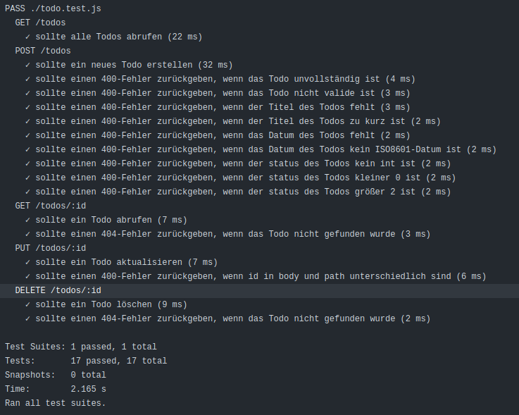
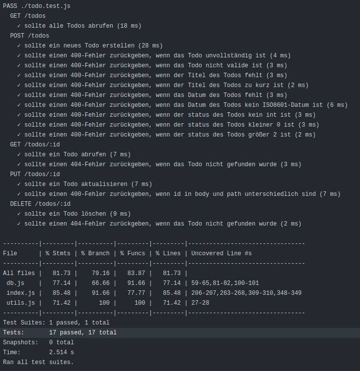

Thomas Tulke

## Vorbereitung

Zunächst wurden die Testwerkzeuge so eingerichtet, dass diese sowohl in der lokalen Entwicklungsumgebung als auch in
GitHub Actions funktionieren. Ausgenommen von der lokalen Einrichtung ist SonarQube, da dieses Tool nur 
in der GitHub-Action-Umgebung funktioniert.

Für die Tests mit **Jest** im Backend wurde eine GitHub-Action eingerichtet. Basierend auf den ersten
Ergebnissen wurde zunächst die `todoValidationRules` erweitert und eine Fake-Authentifizierung für die REST-API
implementiert, um einen fehlerfreien Testdurchlauf zu gewährleisten. Im weiteren Verlauf wurde die Authentifizierung
aufgrund fehlender benötigter Informationen komplett auskommentiert.

**SonarQube** konnte entsprechend der Anleitung ohne Probleme eingerichtet werden. `npm run coverage` 
wird in der GitHub-Action vor SonarQube ausgeführt, um die Testabdeckung anschließend in SonarQube zu übertragen
und anzeigen zu können.

Für **Cypress** wurde im Frontend eine package.json erstellt und initial zwei Tests implementiert. 
Für die GitHub-Action wurde die `test.yml` entsprechend angepasst. 

## Umsetzung

### Jest

Die Unit-Tests orientieren sich an den `todoValidationRules`. Diese wurden entsprechend erweitert und die Tests
angepasst. Die Tests laufen sowohl in der lokalen Entwicklungsumgebung als auch in der GitHub-Action-Umgebung.

### Cypress

- Bei der `id` lagen diverse Fehler/Probleme vor.
  - Die `id` wurde im Frontend mit der `date()`-Funktion generiert und entsprach somit nicht den Anforderungen.
  Das Erstellen eines neuen Eintrags funktionierte zwar, aber beim Aktualisieren und Löschen eines Eintrags wurde eine 24-stellige `id` verlangt.
  - in der Methode `saveTodo` in `todo.js` wird `event.target.dataset.id` anstelle von `event.target.dataset._id` verwendet.
  - Die `id` wird an diversen Stellen nicht als String übergeben.

### SonarQube

- Die Testabdeckung wurde in SonarQube übertragen und ist dort einsehbar. Eine Erhöhung der Testabdeckung
wurde nur marginal vorgenommen, da einerseits bestimmte Bereiche vom Programmfluss nicht erreichbar sind und zum anderen es nicht
sinnvoll ist, allgemeine catch-Blöcke in der `db.js` zu testen. 

- Bugs
  - html lang="de" wurde hinzugefügt.

- Code Smells
  - Es wurden einige nicht verwendete imports entfernt.
  - False Positive: 'TODO' als Platzhalter falsch erkannt
  - False Positive: 'status' ist array 
  - throw-Befehl erwartet ein Error-Objekt angepasst.

- Security Hotspots
  - `app.disable('x-powered-by');` wurde hinzugefügt.
  - Benutzername und Passwort stehen in `utils.js` im Klartext. Dieser Fehler wird ignoriert, da die Authentifizierung
  nicht umgesetzt wurde. Mögliche Lösungen werden in SonarQube vorgeschlagen

## Fazit

Die Testwerkzeuge wurden erfolgreich eingerichtet und die Tests laufen sowohl in der lokalen Entwicklungsumgebung (ausgenommen SonarQube) als auch in
GitHub Actions. Bei der Lösung der Aufgabe gab es unter Zuhilfenahme diverser Dokumentationen keine größeren Probleme. Die Authentifizierung wurde aufgrund fehlender
Informationen auskommentiert. 